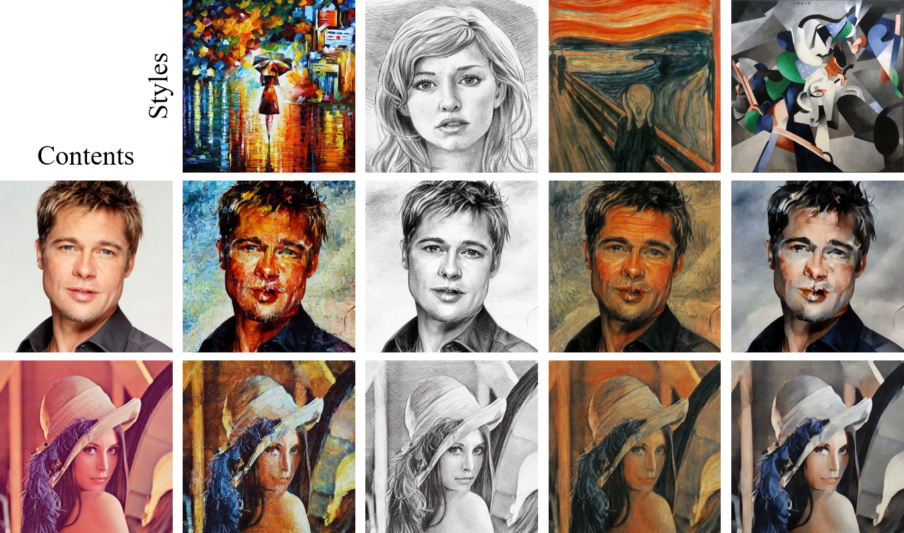

# [CVPR 2024 Highlight] Style Injection in Diffusion: A Training-free Approach for Adapting Large-scale Diffusion Models for Style Transfer

### [Paper](https://openaccess.thecvf.com/content/CVPR2024/html/Chung_Style_Injection_in_Diffusion_A_Training-free_Approach_for_Adapting_Large-scale_CVPR_2024_paper.html) / [Arxiv](https://arxiv.org/abs/2312.09008) / [Project Page](https://jiwoogit.github.io/StyleID_site/)



## Usage

**To run our code, please follow these steps:**

1. [Setup](#setup)
2. [Run StyleID](#run-styleid)
3. [Evaluation](#evaluation)

It may require a single GPU with more than 20GB of memory.
I tested the code in the [pytorch/pytorch:1.8.1-cuda11.1-cudnn8-devel](https://hub.docker.com/layers/pytorch/pytorch/1.8.1-cuda11.1-cudnn8-devel/images/sha256-024af183411f136373a83f9a0e5d1a02fb11acb1b52fdcf4d73601912d0f09b1) Docker image.

#### ** You can also refer to "diffusers_implementation/" for StyleID implementation based on diffusers library. **

## Setup

Our codebase is built on ([CompVis/stable-diffusion](https://github.com/CompVis/stable-diffusion) and [MichalGeyer/plug-and-play](https://github.com/MichalGeyer/plug-and-play))
and has similar dependencies and model architecture.

### Create a Conda Environment

```
conda env create -f environment.yaml
conda activate StyleID
```

### Download StableDiffusion Weights

Download the StableDiffusion weights from the [CompVis organization at Hugging Face](https://huggingface.co/CompVis/stable-diffusion-v-1-4-original)
(download the `sd-v1-4.ckpt` file), and link them:
```
ln -s <path/to/model.ckpt> models/ldm/stable-diffusion-v1/model.ckpt 
```

## Run StyleID

For running StyleID, run:

```
python run_styleid.py --cnt <content_img_dir> --sty <style_img_dir>
```
For running default configuration in sample image files, run:
```
python run_styleid.py --cnt data/cnt --sty data/sty --gamma 0.75 --T 1.5  # default
python run_styleid.py --cnt data/cnt --sty data/sty --gamma 0.3 --T 1.5   # high style fidelity
```

To fine-tune the parameters, you have control over the following aspects in the style transfer:

- **Attention-based style injection** is removed by the `--without_attn_injection` parameter.
- **Query preservation** is controlled by the `--gamma` parameter.
  (A higher value enhances content fidelity but may result a lack of style fidelity).
- **Attention temperature scaling** is controlled through the `--T` parameter.
- **Initial latent AdaIN** is removed by the `--without_init_adain` parameter.

### Save Precomputed Inversion Features
By default, it generates a "precomputed_feats" directory and saves the DDIM inversion feature of each input image.
This reduces the time for two DDIM inversions but requires a significant amount of storage (over 3 GB for each image).
If you encounter "no space left" error, please set the "precomputed" parameter as follows:

```
python run_styleid.py --precomputed "" # not save DDIM inversion features
```

## Evaluation

For a quantitative evaluation, we incorporate a set of randomly selected inputs from [MS-COCO](https://cocodataset.org) and [WikiArt](https://github.com/cs-chan/ArtGAN/tree/master/WikiArt%20Dataset) in "./data" directory.


Before executing evalution code, please duplicate the content and style images to match the number of stylized images first. (40 styles, 20 contents -> 800 style images, 800 content images)

run:
```
python util/copy_inputs.py --cnt data/cnt --sty data/sty
```

We largely employ [matthias-wright/art-fid](https://github.com/matthias-wright/art-fid) and [mahmoudnafifi/HistoGAN](https://github.com/mahmoudnafifi/HistoGAN) for our evaluation.

### Art-fid
run:
```
cd evaluation;
python eval_artfid.py --sty ../data/sty_eval --cnt ../data/cnt_eval --tar ../output
```

### Histogram loss
run:
```
cd evaluation;
python eval_histogan.py --sty ../data/sty_eval --tar ../output
```

Also, we additionally provide the style and content images for qualitative comparsion, in "./data_vis" directory.

## Citation
If you find our work useful, please consider citing and star:
```BibTeX

@InProceedings{Chung_2024_CVPR,
    author    = {Chung, Jiwoo and Hyun, Sangeek and Heo, Jae-Pil},
    title     = {Style Injection in Diffusion: A Training-free Approach for Adapting Large-scale Diffusion Models for Style Transfer},
    booktitle = {Proceedings of the IEEE/CVF Conference on Computer Vision and Pattern Recognition (CVPR)},
    month     = {June},
    year      = {2024},
    pages     = {8795-8805}
}
```
